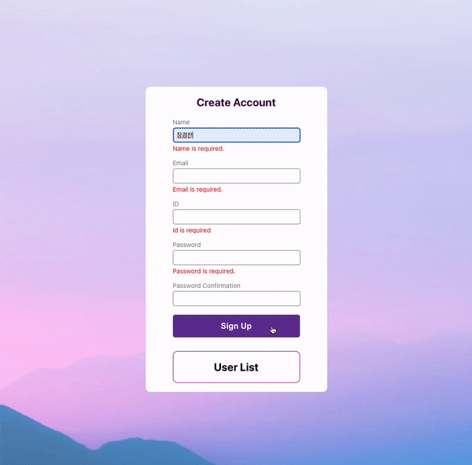
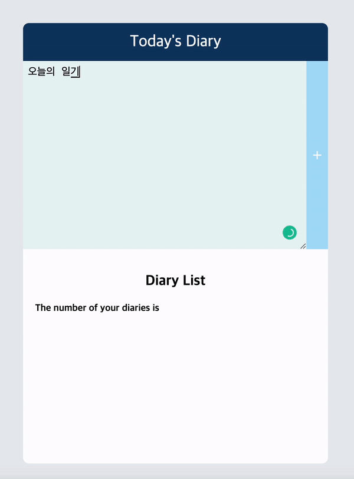

# REACT HANDLING SKILLS STUDY

## Reference Book

  
# Result

> Result of Round 1 - 회원가입 폼 만들기

- 최소문자, 비밀번호와 비밀번화 확인 일치 여부, 이메일 검증 구현
- 검증 통과 못할 경우 화면에 표시

> Result of Round 2 - 일기장 만들기

- 모달창 구현, 편집/삭제, 초기화, 빈칸 입력X

> Result of Round 3 - 제품등록 폼 만들기

- useReducer 활용 -> 최적화
- LocalStorage에 데이터 저장 및 불러오기
